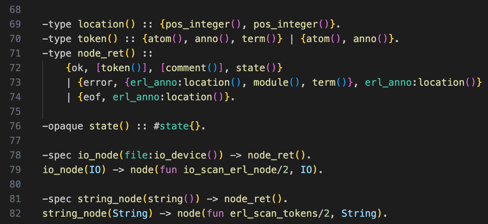
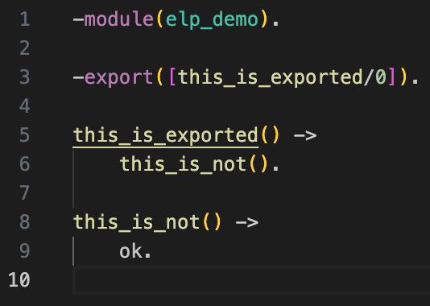
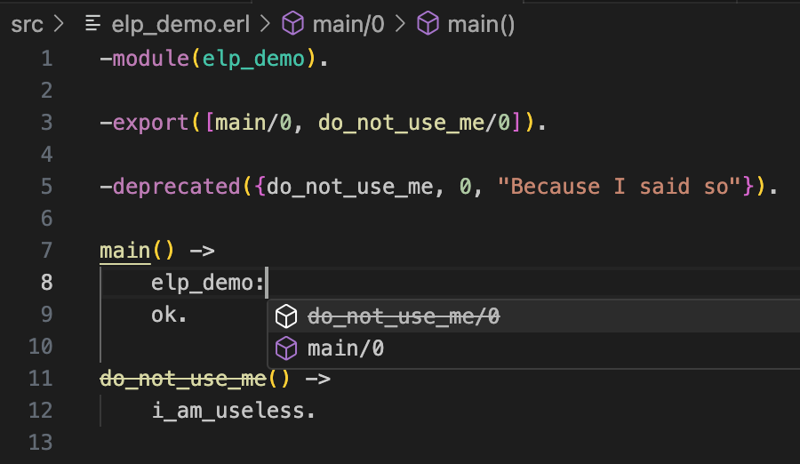
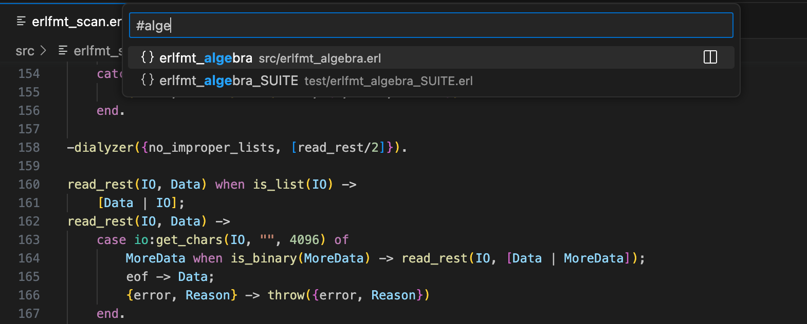

# Feature Gallery

## Syntax Highlighting



## Semantic Syntax Highlighting

In addition to traditional _syntax highlighting_, ELP can highlight the code _semantically_. As an example, _exported_ functions can be rendered differently from un-exported ones and _deprecated_ functions are clearly marked via a strikethrough.





We currently support the following token _modifiers_:

|Token Modifier|Semantic Meaning|
|-|-|
|bound         |The variable used in a pattern is already bound|
|exported_function|The given function is exported|
|deprecated_function|The given function is marked as deprecated|

## Go To Definition

Navigate to the definition of a given identifier. Currently supported for:

* Modules
* Functions
* Records
* Record fields
* Types
* Behaviours
* Macros
* Headers
* Variables

## Find References

Show/peek references to the item at the cursor location.


Currently supported for all items listed in the [Go To Definition](#go-to-definition) section.

## Workspace Symbols

Quickly navigate to a symnol in the workspace.



Currently supported for:

* Modules

## Folding

Collapse/expand sections of the code to focus on what matters.

Currently supported for:

* Functions

## Call Hierarchy

Navigate callers and callees for a given function.

## Documentation on Hover

Extract and present EDoc information when hovering a function call.

## Auto-completion

Provide contextual auto-completion to ease writing code.

Currently supported for:

* Module Attributes
* Functions
* Types
* Keywords
* Macros
* Records
* Record Fields
* Variables

## Signature Help

Get some guidance while invoking a local or remote function, by previewing argument specific documentation.

## Highlight Related Information

Focus on an element and its related info at a glance.

## Inlay Hints

Currently supported for all items listed in the [Go To Definition](#go-to-definition) section.

## Go To Documentation

Have convenient links to the official Erlang/OTP documentation while hovering a function call.

## Diagnostics

In addition to errors and warnings coming directly from the Erlang compiler, ELP provides a number of diagnostics implemented using ELP's own analysis or external tools.

### EDoc

Show warnings and errors from compiling Erlang EDoc pages for the current module.

### Unsafe usage application environment

While it is technically possible to call `application:get_env(Application, Key)` from a module belonging to application A using the name of a different application B, this can sometimes represent a bad smell since it could lead to subtle bugs (e.g. application `B` not being included in the same release.

### Cross-node Evaluation

Sometimes you want to prevent direct RPC calls to different nodes.

### Dependent Header

Return a warning if a header file is not self-contained.

### Deprecated Function

Similarly to XRef, show a warning if you are invoking a deprecated function.

Deprecated functions can either be specified using the `-deprecated` attribute or via code.

When deprecated functions are specified via code, extra information can be included, such as:

* A severity
* A descriptive message
* A link to external documentation

### Effect Free Statement

Return a diagnostic if a statement is just a literal or a variable.

### Head Mismatch

Find mismatches between the clauses of a function declaration.

### Missing `warn_missing_spec` compiler attribute

Return a warning if a the file does not contain a `-compile(warn_missing_spec).` or `-compile(warn_missing_spec_all).` compiler attribute.

### Mispelled Attribute

Spot attributes with names similar to _known_ attributes.

### Module Mismatch

Return an error if the module name does not correspond to the filename.

### Mutable Variable

Detect instances for the OTP [mutable variable bug](https://github.com/erlang/otp/issues/6873).

It works by looking for a chain of match expressions where the constituent elements are already bound. E.g.:

```erlang
test() ->
    Zero = 0,
    One = 1,
    Result = One = Zero,
    ^^^^^^^^^^^^^^^^^^^
```

### Redundant Assignment

Check for redundant assignments before returning.

### No-op Call

Warn if a function representing a no-op is invoked.

### Trivial Match

Return a diagnostic if a match will trivially always succeed.

### Unreachable Test Case

In a Common Test suite, tests are defined via a callback function: `all/0`. Tests can also be grouped together and groups definitions are provided via an additional callback function: `groups/0`.

A test case is deemed unreachable if:

  * A corresponding function with arity 1 exists
  * The function is exported
  * The function is not one of the Common Test callback functions
  * The function is not reachable via the `all/0` and `groups/0` functions

### Unused Function Argument

Warn about arguments passed through functions but never used.

### Unused Include

Warn about an `-include` statement from which nothing is used.

### Unused Macro

Warn about macros defined in modules (not in header files), but never used.

### Unused Record Fields

Warn about record fields which are never used.

## Quick Fixes (Assists)

### Add EDoc

Add a stub for EDoc documentation if not present.

### Add Format tag

Add the `% @format` pragma to opt-in formatting.

### Add Implementation

Given a `-spec` attribute, provide a stub for the actual function if not present.

### Add Spec

Given a function, provide a stub for the `-spec` attribute for such a function.

### Implement Behaviour Callbacks

Provide stubs for the un-implemented behaviour callbacks.

## Refactoring

ELP contains built-in capabilities for analyzing and refactoring Erlang code.

### Extract Function

Extract the selected expression(s) into a separate function and invoke it.

### Inline Function

Reverse of [Extract Function](#extract-function). Given a function, replace all invokations with the body of the function.

### Create Function

Add a new function.

### Delete Function

Remove the entire function.

### Extract Variable

### Ignore Variable

Prepend the variable name with a `_` (underscore).

### Inline Variable

Replace a variable with the RHS (right-hand-side) of a previous assignment.

### Bump Variables

Given how variables are immutable in Erlang, it is sometimes common to see patterns such as:

```erlang
handle_request(Request0) ->
  Request1 = first_do(Request0),
  Request2 = then_do(Request1),
  Request3 = then_do(Request2),
  [...]
```

This refactoring allows selecting one of the instances and bump all instances afterwars.

### Flip Around Separator

Given two elements surrounding a separator, flip them. It can be used, for example, to flip the order of two function arguments around a comma.

## Test Runner

Run/Debug _Common Test_ test-cases or an entire test suite via convenient code lenses. Support Common Test groups.
